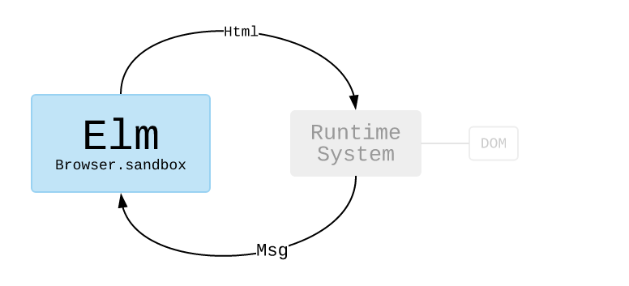

# A Arquitetura Elm MVU

## Visão Geral

A [arquitetura Elm](https://guide.elm-lang.org/architecture/) segue o paradigma Model-View-Update. Este diagrama representa esse ciclo contínuo:




Para ver como fica o código vamos tomar como exemplo um formulário com dois campos representado. O modelo consiste em um type alias e um valor constante init.

```elm
-- MODEL

type alias Model =
  { name : String
  , password : String
  }

init : Model
init =
    { name = ""
    , password = ""
    }
```


Já a função update tem uma assinatura mais complexa. Ela recebe como primeiro argumento a Message (Msg) da interação com o app, como segundo argumento o estado atual do modelo e retorna o estado final do modelo.


```elm
-- UPDATE

type Msg
  = Name String
  | Password String

update : Msg -> Model -> Model
update msg model =
  case msg of
    Name name ->
      { model | name = name }

    Password password ->
      { model | password = password }
```

```elm
-- VIEW

view : Model -> Html Msg
view model =
  div []
    [ viewInput "text" "Name" model.name Name
    , viewInput "password" "Password" model.password Password
    ]

viewInput : String -> String -> String -> (String -> msg) -> Html msg
viewInput t p v toMsg =
  input [ type_ t, placeholder p, value v, onInput toMsg ] []
```

Mas o que é exatamente esse Html Msg?

## O tipo Html Msg
TODO

## Variações da arquitetura Elm

A arquitetura Elm está disponível em algumas variações:

### Sandbox

TODO

```elm
main =
  Browser.sandbox { init = init, update = update, view = view }
```


### Element

TODO

```elm
main =
  Browser.element
    { init = init
    , view = view
    , update = update
    , subscriptions = subscriptions
    }
```

### Application

TODO

```elm
main : Program () Model Msg
main =
  Browser.application
    { init = init
    , view = view
    , update = update
    , subscriptions = subscriptions
    , onUrlChange = UrlChanged
    , onUrlRequest = LinkClicked
    }
```


