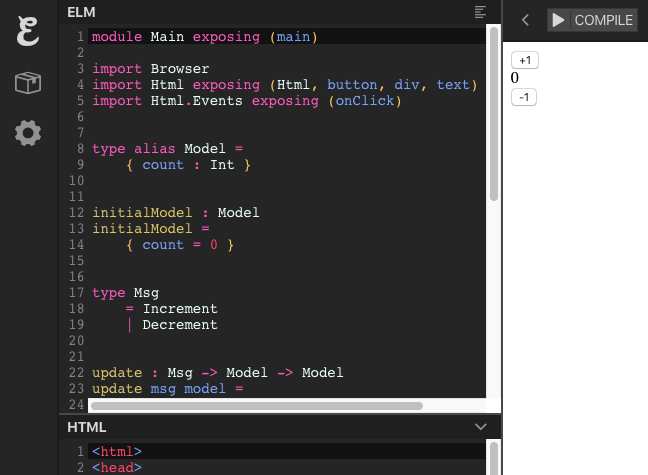

# Ferramentas

## Elm Repl
Apesar de Elm ser uma linguagem compilada ela tem o console o [Elm Repl](https://elm-lang.org/news/repl), similar ao que existe em muitas linguagens interpretadas. Ele aparece no [guia oficial](https://guide.elm-lang.org/core_language.html) é muito útil para testar expressões simples:


O repl também pode ajudar a entender algumas partes mais complexas do Elm como [decoders](https://medium.com/@jxxcarlson/elm-types-and-json-decoders-cracking-the-code-e2be61f8afcd) pois imprime os tipos de cada expressão o que pode ser um bom guia nestes casos.

## Ellie
Para testar uma aplicação completa e compartilhá-la com os colegas você pode usar o [Ellie](https://ellie-app.com/).



## Elm Reactor
E para desenvolvê-la na sua própria máquina é recomendado utilizar o Elm Reactor. É só iniciar um projeto e depois  `elm reactor` para iniciar o servidor.


## Editor

### Neovim
Depois você pode abrir o seu editor de código favorito para começar a mexer com Elm. Aqui no CJ a maioria do pessoal que mexe com Elm usa o Neovim. Mas há outros editores com suporte a Elm, como o [Sublime Text](#sublime-text), VS Code, entre outros, que podem ser interessantes também.


#### Configurando o Neovim usando CoC (Recomendado)

1. Faça download da última versão estável do Neovim [aqui](https://github.com/neovim/neovim/releases/download/stable/nvim.appimage)
2. Se você ainda não tem, instale um gerenciador de plugins, pois sem ele não conseguiremos instalar nenhum plugin, de forma fácil, no Neovim. Instale o Vim-plug seguindo [essas instruções](https://github.com/junegunn/vim-plug#neovim)
3. Para instalar o CoC, que é um cliente de LSP (Language Server Protocol). Abra seu arquivo de configuração do Neovim `init.vim` (se não sabe onde ele está, no seu Neovim, digite `:echo stdpath('config')` e dê `Enter`, vai aparecer a pasta onde está o `init.vim`) e adicione as seguintes linhas:
```viml
" Specify a directory for plugins
call plug#begin(stdpath('data') . '/plugged')

Plug 'neoclide/coc.nvim', {'branch': 'release'}

" Initialize plugin system
call plug#end()
```
Salve o arquivo e execute `:source %` para que as configurações sejam recarregadas. Por último, execute `:PlugInstall` para que o CoC seja instalado.

4. Para configurar o CoC, você pode usar [essa configuração de exemplo](https://github.com/neoclide/coc.nvim#example-vim-configuration). Assim você já vai ter os mapeamentos de teclas para as funções do CoC.
5. Siga [essas instruções](https://github.com/elm-tooling/elm-language-server#installation) para instalar, no seu computador, o Language Server do Elm e [integra-lo ao Neovim através do CoC](https://github.com/elm-tooling/elm-language-server#cocnvim). Atenção para os [requisitos](https://github.com/elm-tooling/elm-language-server#requirements)

Ao final desse processo, você já deve conseguir ver os erros do compilador, ter autocomplete entre outras funcionalidades.

#### Configurando o Neovim o cliente nativo (Não-estável)
1. Faça download da última versão **não-estável** do Neovim [aqui](https://github.com/neovim/neovim/releases/download/nightly/nvim.appimage)
2. Se você ainda não tem, instale um gerenciador de plugins, pois sem ele não conseguiremos instalar nenhum plugin, de forma fácil, no Neovim. Instale o Vim-plug seguindo [essas instruções](https://github.com/junegunn/vim-plug#neovim)
3. Para usar o cliente nativo, abra seu arquivo de configuração do Neovim `init.vim` (se não sabe onde ele está, no seu Neovim, digite `:echo stdpath('config')` e dê `Enter`, vai aparecer a pasta onde está o `init.vim`) e adicione as seguintes linhas:
```viml
" Specify a directory for plugins
call plug#begin(stdpath('data') . '/plugged')

" Cliente nativo de LSP
Plug 'neovim/nvim-lspconfig'

" Autocomplete
Plug 'nvim-lua/completion-nvim'

" Initialize plugin system
call plug#end()
```
Salve o arquivo e execute `:source %` para que as configurações sejam recarregadas. Por último, execute `:PlugInstall` para que os plugins sejam instalados.

4. Siga [essas instruções](https://github.com/neovim/nvim-lspconfig/blob/master/CONFIG.md#elmls) para instalar o Language Server do Elm.
5. Para configurar o cliente nativo, você pode usar [essa configuração de exemplo](https://github.com/neovim/nvim-lspconfig/blob/master/CONFIG.md#elmls). Porém, faça as seguintes modificações:
    1. No lugar de `local servers = { "pyright", "rust_analyzer", "tsserver" }` coloque `local servers = { "elmls" }`
    2. Na linha  acima de `-- Mappings.` coloque `require'completion'.on_attach(client)`
    3. Na linha acima de `-- Set autocommands conditional on server_capabilities` coloque

```viml
if client.config.flags then
  client.config.flags.allow_incremental_sync = true
end
```

6. Para configurar o autocomplete siga [essas instruções](https://github.com/nvim-lua/completion-nvim#recommended-setting)

Ao final desse processo, você já deve conseguir ver os erros do compilador, ter autocomplete entre outras funcionalidades.


### Sublime Text

Se não sabe como ou não quer usar o Neovim, uma boa opção é o Sublime Text. Há um tempo atrás, era o que o pessoal aqui do CJ usava, seguindo a [sugestão do guia oficial](https://guide.elm-lang.org/install/editor.html).


Como o Elm só aceita identação com espaços e não com tabs, pode ser útil ajustar o seu editor para preencher com espaços quando você apertar a tecla tab.


#### Configurando o Sublime
Para começar, baixe e instale o Sublime Text [aqui](https://www.sublimetext.com/).

Para configurar o Sublime Text para ter uma melhor experiência no desenvolvimento com Elm precisamos de alguns plugins que podem ser instalados seguindo os seguintes passos:

1. Certifique-se de que o [Package Control](https://packagecontrol.io/) esteja instalado seguindo [esses passos](https://packagecontrol.io/installation), pois você vai precisar dele para instalar os próximos pacotes;
2. Instale o [Elm Syntax Highlighting](https://packagecontrol.io/packages/Elm%20Syntax%20Highlighting) para habilitar o reconhecimento da sintaxe do Elm;
3. Instale o [Elm Format on Save](https://packagecontrol.io/packages/Elm%20Format%20on%20Save) para formatar o código ao salvar utilizando o padrão da comunidade;
4. Instale o [LSP](https://packagecontrol.io/packages/LSP) e siga [esses](https://lsp.readthedocs.io/en/latest/#elm) passos para integrar o Sublime com um servidor da linguagem Elm. Com isso podemos ver no próprio editor os erros e avisos que o compilador do Elm nos fornece.


## Elm-Format

A comunidade Elm utiliza muito o [elm-format](https://github.com/avh4/elm-format) para manter uma formatação padronizada do código. Se você configurar a integração com o seu editor, basta escrever o código de qualquer jeito, apertar o atalho para salvar que daí o código já fica formatado apropriadamente.

O lado positivo de ter um estilo de formatação único em toda a comunidade é que (quase) não se gasta tempo discutindo o estilo. Juntando isso com o compilador que pega mais de 90% dos possíveis problemas da aplicação, o code review de Elm é muito fácil (quando existir).


## Create-elm-app e Webpack

O Elm Reactor funciona bem para trabalhar com Elm, mas ele não tem integração com bibliotecas do ecossistema Node.js, como SASS e CSS Modules. Por isso em produção nós utilizamos o [create-elm-app](https://github.com/halfzebra/create-elm-app) para configurar o Webpack com [algumas customizações](https://github.com/CalculoJuridico/calculojuridico-web-checkout/blob/master/elmapp.config.js).

Importante: Para integrar o Webpack com o Elm utilizamos [flags de inicialização da aplicação](https://github.com/CalculoJuridico/calculojuridico-web-checkout/blob/bb1e70f9ce0b3b5c83608bafd9ca46c215b0003f/src/index.js#L17). Isso nos permite usar, por exemplo, [CSS Modules](https://github.com/CalculoJuridico/calculojuridico-web-checkout/blob/bb1e70f9ce0b3b5c83608bafd9ca46c215b0003f/src/scripts/assets/styles.js) e [obter as dimensões das imagens rasterizadas](https://github.com/CalculoJuridico/calculojuridico-web-checkout/blob/bb1e70f9ce0b3b5c83608bafd9ca46c215b0003f/src/scripts/assets/images.js) via Webpack (no caso de vetores SVG isso não é necessário).
