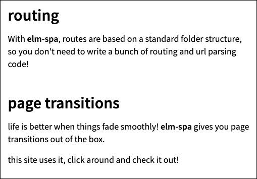

# Single page apps (SPA)
Referência [https://github.com/CalculoJuridico/calculojuridico-web-onboarding/issues/2](https://github.com/CalculoJuridico/calculojuridico-web-onboarding/issues/2)

# Visão geral da implementação
Em Elm é comum chamar o tipo principal das rotas da aplicação de Route e deixar todas no arquivo /Route.elm. Esse tipo Route seria o equivalente ao Status que você fez. Com o parser da url será gerado um Maybe Route. Se for Nothing é porque não existe a rota específica (404). [Este exemplo](https://github.com/rtfeldman/elm-spa-example/blob/master/src/Route.elm) é o jeito canônico de se fazer rotas em Elm. Repare que é bem parecido com o tipo Status que você fez, só falta fazer o _parser_ para transformar uma String (raw url) em Maybe Route. Também é bom ter uma função que transforma a rota em url para usar nos href da navegação interna (routeToString : Route -> String).

```elm
type alias Pages =
    { creating : CreatingModel
    , initialConfig : InitialConfigModel
    , editFgts : EditFgtsModel
    , editCalc : EditCalcModel
    , result : ResultModel
    }
```

Não gostamos dessa estratégia porque pode ocupar muita memória desnecessariamente, além de favorecer uma mentalidade que não pensa no init de cada página. Prefirimos usar a estratégia do custom type e cada página seria uma variante:

```elm
type Page 
    = CreateCalc NewCalcForm
    | Overview InitializedCalc
    | EditFgts InitializedCalc FgtsForm
    | EditCalc InitializedCalc CalcForm
    | Result CalcResult
```

Então seguiria esse fluxo:

1. Evento de mudança da url (use o [Browser.application](https://package.elm-lang.org/packages/elm/browser/latest/Browser#applicatio) para captar esse evento);
2. Parse da url (Route.fromUrl url) para Maybe Route;
3. Verificar num case e atualizar o Model conforme a rota:


```elm
case maybeRoute of
    Nothing ->
        ({ model | page = NotFound }, Cmd.none)

    Just Creating ->
        ({ model | page = CreateCalc initCreateCalcModel }, Cmd.none)
    ...
   
```

4. O update vai ter uma complexidade a mais, que é testar se a Msg é compatível com a página atual, que terá que ser extraída com um case:


```elm
case msg of
    UpdateSomeCreateCalcInput ->
        case model.page of
            CreateCalc pageModel ->
                ( { model | page = CreateCalc (someTransform pageModel) }, Cmd.none )

            _ ->
                -- Página incompatível com a mensagem!
                ( model, Cmd.none )
           ...
```

5. A view continua só refletindo o estado atual.

## Uso de bibliotecas externas

O projeto [elm-spa](https://www.elm-spa.dev/) parece promissor para ajudar a reduzir o código repetitivo (boilerplate).


